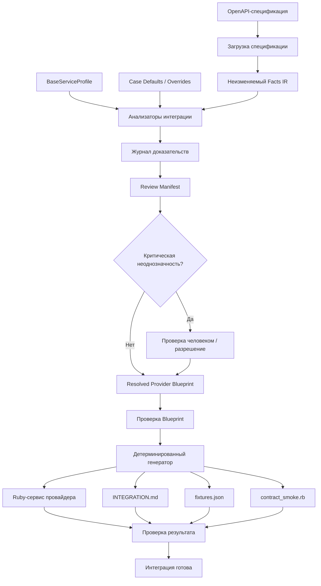
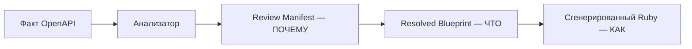

# Provider Compiler

[](https://github.com/EdYaRdx/Ruby_hack/actions/workflows/ci.yml)

> OpenAPI → Provider Blueprint на основе доказательств → проверенный Ruby-адаптер

Provider Compiler принимает OpenAPI платёжного провайдера, сопоставляет
API провайдера с контрактом Space Payments, формирует `Review Manifest` и
`Resolved Provider Blueprint`, а затем детерминированно генерирует Ruby-адаптер,
документацию и fixtures. Критическая неоднозначность не угадывается: система
переходит в `REVIEW_REQUIRED` / `BLOCKING` и запрещает небезопасную генерацию.

| | |
|---|---|
| Вход | OpenAPI YAML / JSON |
| Выход | Ruby adapter + `INTEGRATION.md` + `fixtures.json` |
| Целевой контракт | `Provider::BaseService` |
| Модель решения | `ACCEPT` / `REVIEW_REQUIRED` / `UNKNOWN` |
| Безопасность | критическая неоднозначность → генерация заблокирована |
| Runtime | Ruby, детерминированная работа, без нейросетей |

## Проблема

Space Payments регулярно подключает новых платёжных провайдеров. Ручная
интеграция включает чтение документации, сопоставление endpoint-ов и полей,
конвертацию денежных единиц, статусы, аутентификацию, webhooks, idempotency,
ошибки, Ruby-адаптер, fixtures и документацию интеграции; один provider
занимает примерно 2–5 дней.

Обычный OpenAPI codegen автоматизирует шаблонный HTTP-код, но не отвечает на
главный вопрос: как API конкретного провайдера отображается на доменный
контракт платежей Space Payments. Именно это сопоставление, а не создание
HTTP-классов, является
центральной задачей Provider Compiler.

## Чем отличается от OpenAPI Generator

Обычный OpenAPI codegen:

```text
OpenAPI
  → API-клиент / SDK
```

Provider Compiler:

```text
OpenAPI
  → факты
  → платёжная семантика
  → доказательства / проверка
  → Provider Blueprint
  → проверенный адаптер Provider::BaseService
```

| | OpenAPI Generator | Provider Compiler |
|---|---|---|
| HTTP-клиент | Да | Да, как часть адаптера |
| Платёжная семантика | Нет | Да |
| Сопоставление статусов | Обычно нет | Да |
| Денежные единицы | Обычно нет | Да |
| Проверка неоднозначной семантики | Нет | Да |
| Безопасная генерация с остановкой | Нет | Да |
| Адаптер `Provider::BaseService` | Нет | Да |

Provider Compiler не позиционируется как универсальный генератор SDK: его
результатом является проверяемая проекция API провайдера на конкретный контракт
хост-системы.

## Как работает

1. OpenAPI читается и нормализуется; локальные `$ref` разрешаются до анализа.
2. Неизменяемый `Facts IR` сохраняет факты входного документа без семантических догадок.
3. Независимые анализаторы строят решения для операций, денег, аутентификации,
   полей, статусов, webhooks, idempotency, ограничений и ошибок.
4. Доказательства и provenance попадают в `Review Manifest` вместе с обоснованием,
   конфликтами и результатом.
5. Разрешённые решения формируют `Provider Blueprint` — источник истины для
   генерации.
6. Критическая неоднозначность переводит pipeline в безопасное состояние с остановкой.
7. Детерминированный генератор создаёт Ruby-адаптер и сопутствующие артефакты.
8. Verification проверяет сгенерированный результат.

## Архитектура



Слои намеренно разделены:

- `Spec Ingestion` — YAML/JSON, проверка OpenAPI, разрешение локальных `$ref` и
  fingerprint исходного набора входных файлов;
- `Facts IR` — неизменяемый набор фактов без семантических догадок;
- `Analyzers` — сопоставление provider-to-host и решения по безопасности;
- `Review Manifest` — почему принято решение: доказательства, provenance,
  обоснование, конфликты и результат;
- `Provider Blueprint` — что именно будет сгенерировано;
- `Generator` — как это будет выражено в детерминированной Ruby-проекции без новых
  семантических решений;
- `Verification` — проверка сгенерированного результата.

### Review Manifest vs Provider Blueprint



`Review Manifest` отвечает: «почему принято это решение?». `Provider Blueprint`
отвечает: «какой должна быть интеграция?». Сгенерированный Ruby отвечает: «как это
исполняется?». Сгенерированный Ruby не является источником истины: им остаётся
resolved Blueprint, а provenance решения сохраняется в Manifest.

### Ключевые инварианты

- `FACT` не равен `INFERENCE`; Facts IR неизменяем.
- Семантические решения не живут в templates.
- Resolved Blueprint — источник истины, сгенерированный Ruby — проекция.
- Критическая семантика обрабатывается fail-closed; каждое решение имеет provenance.
- Неизвестная информация провайдера сохраняется и показывается.
- CLI и Web используют один Application/Core pipeline.
- Предположения конкретного провайдера не попадают в общий core.

## Безопасная остановка (fail-closed)

Например, если в спецификации есть только:

```yaml
amount:
  type: integer
```

но не указано, используются ли major или minor units, какой scale и какова
семантика currency, система не выбирает молча `×100` или `÷100`. Результат —
`REVIEW_REQUIRED`, `BLOCKING`, генерация недоступна. Для критической финансовой
семантики система предпочитает безопасную остановку потенциально неверной
генерации.

## Автоматически обновляемый снимок возможностей

Снимок возможностей ниже генерируется из checkout проекта, canonical example и
результатов проверок. Он обновляется командой `bin/update_docs`.

<!-- BEGIN GENERATED: CAPABILITIES -->
- Загрузка OpenAPI, разрешение локальных ссылок и fingerprint источника реализованы в `lib/provider_compiler/core.rb`.
- Анализ с учётом доказательств, `Review Manifest` и `Provider Blueprint` реализованы в слоях analyzer/profile/blueprint.
- Детерминированная Ruby-проекция и проверка результата реализованы в слоях generator и verification.
- Канонический пример NovaPay: 9 файлов в `examples/novapay/` (`INTEGRATION.md`, `INTEGRATION_READINESS.md`, `contract_smoke.rb`, `fixtures.json`, `integration_readiness.json`, `provider_api.yaml`, `provider_blueprint.json`, `review_manifest.json`, `service.rb`).
- Независимая проверка семантики: benchmark мутаций NovaPay и сравнения Aurora/Helios включены в сгенерированный статус ниже.
- Реальные вызовы провайдера не реализованы; локальный Web UI Demo Workbench реализован в `lib/provider_compiler/web.rb`, `lib/provider_compiler/web_renderer.rb` и `web/public/`.

Выполните `ruby bin/update_docs`, чтобы обновить этот снимок.
<!-- END GENERATED: CAPABILITIES -->

## CLI

### Приоритет входов и режим только по спецификации

OpenAPI — основной источник семантики. `CaseDefaults` — необязательные явно
переданные переопределения провайдера или резервные бизнес-знания; они не
выбираются по имени загруженного файла или fingerprint.

```powershell
# произвольный провайдер: пустые defaults
ruby bin/provider_compiler inspect --spec path/to/provider.yaml

# явные знания конкретного провайдера
ruby bin/provider_compiler inspect --spec path/to/provider.yaml `
  --defaults path/to/provider_defaults.yml
```

Вывод `inspect` показывает `spec`, профиль хоста и `provider_defaults`, поэтому
источники знаний видны явно. Встроенная команда эталонного NovaPay остаётся
явным демонстрационным режимом, а не общим путём загрузки.

Приоритет для сгенерированных fixtures: `SPEC_EXAMPLE` > example/default/enum
схемы > детерминированный sample схемы > fallback из `CaseDefaults`. Каждый
сгенерированный `fixtures.json` сохраняет provenance и остаётся побайтно
детерминированным.

Требуется Ruby >= 3.3. CI проверяет Ruby 3.3; текущий checkout дополнительно проверен на Ruby 4.0.6 и Bundler 2.5.22.

```powershell
bundle install
bundle exec rspec
ruby -c lib/provider_compiler.rb
ruby bin/provider_compiler inspect
ruby bin/provider_compiler analyze
ruby bin/provider_compiler generate --out tmp/generated
ruby bin/provider_compiler verify --out tmp/generated
```

### Persisted Review и readiness

Подтверждённые человеком решения можно экспортировать в версионируемый
`provider_overrides.yml` и применить повторно:

```powershell
ruby bin/provider_compiler export-review `
  --spec path/to/provider.yaml `
  --profile profiles/space_payments_v1.yml `
  --defaults path/to/provider_defaults.yml `
  --resolutions path/to/resolutions.yml `
  --review-output provider_overrides.yml

ruby bin/provider_compiler generate `
  --spec path/to/provider.yaml `
  --profile profiles/space_payments_v1.yml `
  --defaults path/to/provider_defaults.yml `
  --overrides provider_overrides.yml `
  --out tmp/generated
```

Override содержит `spec_fingerprint`, hash корневого документа, profile/version
и только решения с provenance `HUMAN_CONFIRMED`. Изменённая спецификация,
несовместимый profile, неизвестный decision id или credential-like поле приводят
к отказу, а не к тихому применению старого решения. Web UI предоставляет те же
операции через Review: `Export decisions` и `Import decisions`.

`generate` дополнительно создаёт `INTEGRATION_READINESS.md` и
`integration_readiness.json`. Это отчёт по фактическим Blueprint, verification,
decision counts, extra operations, runtime configuration и ограничениям; он не
заменяет внешний staging acceptance.

`inspect` выводит сводку решения. `analyze` создаёт только machine-readable
`provider_blueprint.json` и `review_manifest.json`; для `REVIEW_REQUIRED` или
`BLOCKING` он завершается успешно как analysis command, но показывает
`generation_ready: false` и не создаёт runtime integration artifacts.
`generate` выполняет Blueprint validation перед генерацией и fail-closed
останавливается на unresolved critical semantics. `verify` принимает каталог
сгенерированного результата и запускает проверку синтаксиса Ruby и
`contract_smoke.rb`.

Для другого провайдера используются явные входы:

```powershell
ruby bin/provider_compiler generate `
  --spec path/to/provider.yaml `
  --profile profiles/space_payments_v1.yml `
  --defaults path/to/provider_defaults.yml `
  --out tmp/provider
```

Профили и case defaults остаются входами конкретного кейса, а предположения
провайдера не зашиваются в общий код анализаторов. Вместо `--out` можно передать
полный alias `--output`; `PROVIDER_SPEC` задаёт спецификацию по умолчанию.

## Эталонный пример NovaPay

Воспроизводимый источник —
[`fixtures/novapay_provider_api.yaml`](fixtures/novapay_provider_api.yaml).
Каноническая сгенерированная проекция поддерживается командой
`bin/update_examples` в каталоге [`examples/novapay/`](examples/novapay/).
SHA-256 официального reference input:
`415F50EE36FB331DFAB49CEED0E8ED3B0EBE16053D7E00DBABD32282F4396551`.

Эталонный кейс показывает:

- `POST /payouts` -> `create_request`;
- `GET /payouts/{payout_id}` -> `fetch_status`, operationId
  `getPayoutStatus`;
- базовый sandbox URL из официальной спецификации: `https://api.sandbox.novapay.example/v1`;
- `operation.amount` хоста как major RUB и amount провайдера как minor kopecks;
  request conversion — `major -> minor` с factor `100`;
- необязательный в OpenAPI `Idempotency-Key`; по умолчанию адаптер отправляет
  переданный ключ (`if_available`), а `--always-send-idempotency` — явная политика
  адаптера, не факт спецификации;
- `/balance` сохраняется как неблокирующий `EXTRA_OPERATION`;
- webhook `payout.completed` с `X-NovaPay-Signature`, HMAC-SHA256, raw body и
  hex encoding;
- сопоставление статуса провайдера `completed` → `approved`;
- событие webhook `payout.completed` → `approved` → callback action
  `approve_operation`.

End-to-end пример для `1500.50 RUB`:

```text
Space Payments operation.amount: 1500.50 RUB
  → major_to_minor ×100
NovaPay request.amount: 150050 kopecks

NovaPay status: completed
  → Space Payments status: approved
  → callback action: approve_operation
```

`GET /balance` не становится canonical `BaseService` operation без основания: он
сохраняется как `EXTRA_OPERATION` и остаётся неблокирующим.

## Что генерируется

Команда `analyze` создаёт только два analysis artifacts:

```text
tmp/analyzed/
├── provider_blueprint.json
└── review_manifest.json
```

Команда `generate` создаёт восемь файлов в каталоге результата:

```text
tmp/generated/
├── service.rb
├── INTEGRATION.md
├── fixtures.json
├── provider_blueprint.json
├── review_manifest.json
├── contract_smoke.rb
├── INTEGRATION_READINESS.md
└── integration_readiness.json
```

- `service.rb` — сгенерированный адаптер `Provider::BaseService`;
- `INTEGRATION.md` — настройка и использование интеграции;
- `fixtures.json` — примеры request/response/webhook;
- `provider_blueprint.json` — разрешённый контракт интеграции;
- `review_manifest.json` — доказательства и решения;
- `contract_smoke.rb` — исполняемый runtime smoke test;
- `INTEGRATION_READINESS.md` / `integration_readiness.json` — фактический
  readiness report для человека и автоматизации.

Канонический `examples/novapay/` дополнительно хранит копию входного
`provider_api.yaml`, поэтому там семь файлов. Сгенерированные артефакты следует
пересоздавать из fixture/profile/defaults, а не редактировать вручную.

## Web UI

Локальный Demo Workbench показывает тот же pipeline, не меняя семантику
компилятора:

```powershell
bundle exec ruby bin/provider_compiler_web
```

Откройте `http://127.0.0.1:4567` и пройдите сценарий
«Загрузка» → «Анализ» → «Review» → «Preview» → «Generate». На экране анализа
видны endpoint-ы, канонические операции, аутентификация, деньги, статусы, webhook,
idempotency, сопоставления полей, ограничения, ошибки и доказательства. Review
показывает решения Manifest и их основания; Preview выполняет проекции
request/response/webhook на fixture-данных; Generate показывает артефакты и результат проверки.

На стартовом экране доступны NovaPay, неоднозначный money-case и Aurora. UI не
выполняет реальных сетевых вызовов к провайдеру.

## Что система анализирует

| Область | Пример |
|---|---|
| Операции | `POST /payouts` → `create_request` |
| Аутентификация | `X-API-Key` |
| Деньги | `major` → `minor` ×100 |
| Поля | `operation.amount` → `request.amount` |
| Статусы | `completed` → `approved` |
| Webhooks | `HMAC-SHA256` |
| Idempotency | `Idempotency-Key` |
| Ограничения | `required` / `minimum` / `enum` |
| Ошибки | `400` / `401` / `409` / `422` / `429` / `500` |
| Дополнительные операции | `/balance` сохраняется как `EXTRA_OPERATION` |

## Verification

`Verification` проверяет только существующие в реализации контрольные точки:
наличие сгенерированных `service.rb` и `contract_smoke.rb`, синтаксис Ruby для
обоих файлов и успешное выполнение contract smoke. Сам smoke проверяет проекцию request,
конвертацию денег, sandbox URL, сопоставление response/status и поведение webhook
на fixture-данных.

## Универсальность и benchmark

Универсальность здесь означает переносимость общего pipeline на проверенные
формы провайдерских API, а не поддержку любого OpenAPI. Проверка состоит из
эталонного кейса NovaPay, 37 независимо материализованных сценариев мутаций с
самостоятельно подготовленной semantic ground truth и independent comparator,
а также второго синтетического провайдера Aurora с другой структурой API.

Aurora проверяет другие имена endpoint-ов, Bearer-аутентификацию, вложенные `money.value`,
`money.currency`, destination, `POST /notifications`, собственные status enums и
preserved extra operations. Для него отдельно заданы semantic levels и
behavioral vectors; decision equality сама по себе не считается доказательством.

HeliosPay — независимая проверка третьего провайдера с заранее подготовленной
ground truth, созданной до запуска compiler. Он проверяет другие operationId и
paths, query API-key auth, вложенные `payment` / `settlement` money, обработку
успешного HTTP `202`, коды ошибок провайдера и `Retry-After`, события webhook,
а также сохранение `/account/limits` как extra operation. Это дополнительное доказательство,
что generic pipeline не привязан к NovaPay literals; это не заявление о полной
универсальности для любого OpenAPI.

В этой проверке Aurora — второй синтетический провайдер, а HeliosPay — независимая
проверка третьего провайдера.

Подробная методика и определения метрик находятся в
[`docs/BENCHMARK.md`](docs/BENCHMARK.md). Исторический comparator record — в
[`research/SEMANTIC_BENCHMARK_VALIDATION.md`](research/SEMANTIC_BENCHMARK_VALIDATION.md),
а supporting validation второго провайдера — в
[`research/SECOND_PROVIDER_VALIDATION.md`](research/SECOND_PROVIDER_VALIDATION.md).

## Статус проверки

Следующий блок генерируется `bin/update_docs` на основе реальных benchmark
runner-ов и текущего запуска RSpec. Числа не копируются вручную.

<!-- BEGIN GENERATED: PROJECT_STATUS -->
**Текущий снимок проверки (сгенерировано)**

- RSpec: 106 примеров, ошибок: 0.
- Reference mutation benchmark: 37/37 adversarial-мутаций одного домена эталонного провайдера; точность семантики: 100.0%; критических ложных ACCEPT: 0.
- Официальный NovaPay spec-only baseline: автоматизация решений 10/14 (71.4%); доля review 4/14 (28.6%); полностью готовых автоматически 0/1 (0.0%); критических ложных ACCEPT 0; попыток небезопасной генерации 0.
- NovaPay spec-only mutation lane: автоматизация решений 74/98 (75.5%); доля review 24/98 (24.5%); полностью готовых автоматически 0/7 (0.0%); критических ложных ACCEPT 0; попыток небезопасной генерации 0.
- Aurora spec-only: автоматизация решений 13/15 (86.7%); полностью готовых автоматически 0/1 (0.0%). Aurora после разрешения: 1/1 (100.0%); behavioral vectors 4/4.
- HeliosPay spec-only: автоматизация решений 12/14 (85.7%); полностью готовых автоматически 0/1 (0.0%). После разрешения: 1/1 (100.0%); behavioral vectors 4/4.

Выполните `ruby bin/update_docs`, чтобы обновить этот снимок по результатам benchmark и RSpec.
<!-- END GENERATED: PROJECT_STATUS -->

## Метрики для оценки

Автоматизация решений показывает долю принятых решений. Полностью готовый кейс
показывает полные спецификации без решений `REVIEW_REQUIRED` и без blocking-записей.
Это разные метрики; безопасность считается отдельно. Безопасность включает
критические ложные `ACCEPT` и попытки небезопасной генерации.

В machine-readable результатах эти показатели называются
`decision_automation_rate`, `fully_auto_ready_rate` и
`unsafe_generation_attempts`.

<!-- BEGIN GENERATED: JUDGE_METRICS -->
| Прогон | Автоматизация решений | Доля review | Полностью готово автоматически | Безопасность |
|---|---:|---:|---:|---|
| Официальный NovaPay spec-only | 10/14 (71.4%) | 4/14 (28.6%) | 0/1 (0.0%) | критических ложных ACCEPT 0; попыток небезопасной генерации 0 |
| NovaPay mutation lane (7 кейсов) | 74/98 (75.5%) | 24/98 (24.5%) | 0/7 (0.0%) | критических ложных ACCEPT 0; попыток небезопасной генерации 0 |
| Aurora spec-only | 13/15 (86.7%) | 2/15 (13.3%) | 0/1 (0.0%) | критических ложных ACCEPT 0; попыток небезопасной генерации 0 |
| Aurora после разрешения | 15/15 (100.0%) | 0/15 (0.0%) | 1/1 (100.0%) | критических ложных ACCEPT 0; попыток небезопасной генерации 0 |
| HeliosPay spec-only | 12/14 (85.7%) | 2/14 (14.3%) | 0/1 (0.0%) | критических ложных ACCEPT 0; попыток небезопасной генерации 0 |
| HeliosPay после разрешения | 14/14 (100.0%) | 0/14 (0.0%) | 1/1 (100.0%) | критических ложных ACCEPT 0; попыток небезопасной генерации 0 |

Автоматизация решений — это метрика принятых решений, а не заявление о готовности. Полная автоматическая готовность означает, что спецификация не содержит решений `REVIEW_REQUIRED` и blocking-записей. Blocking считается отдельно, потому что одно решение может породить несколько blocking-записей. Benchmark также сообщает о контрольных точках генерации и runtime там, где генерация запускалась.
<!-- END GENERATED: JUDGE_METRICS -->

Регрессионное покрытие UI находится в [`spec/web_spec.rb`](spec/web_spec.rb).

## Документация

- [`docs/ARCHITECTURE.md`](docs/ARCHITECTURE.md) — текущая архитектура и
  инварианты;
- [`docs/BENCHMARK.md`](docs/BENCHMARK.md) — методика, формулы и актуальные
  результаты;
- [`docs/DEMO.md`](docs/DEMO.md) — готовый live-сценарий для Web UI, fail-closed,
  Aurora и CLI fallback;
- [`docs/DEVELOPMENT.md`](docs/DEVELOPMENT.md) — процесс разработки и проверок;
- [`docs/DOCS_POLICY.md`](docs/DOCS_POLICY.md) — правила для стабильной и
  сгенерированной документации;
- [`docs/COMPLIANCE.md`](docs/COMPLIANCE.md) — аудит доли Ruby в исходном коде;
- [`docs/GLOSSARY.md`](docs/GLOSSARY.md) — единый словарь терминов;
- [`THIRD_PARTY.md`](THIRD_PARTY.md) — зависимости и лицензии;
- [`research/README.md`](research/README.md) — исследовательские материалы и
  audit-артефакты с явным разделением текущих и исторических данных.

## Структура репозитория

```text
bin/                    CLI, Web entrypoint и детерминированные updater-ы
lib/provider_compiler/  Facts IR, анализаторы, Blueprint, генерация, Web/API
profiles/               BaseServiceProfile для контракта хоста
fixtures/               OpenAPI, case defaults и независимая ground truth Aurora
examples/               сгенерированные и проверяемые проекции провайдеров
spec/                   RSpec-проверки, семантика и Web UI
research/               benchmark corpus, comparator и исторические материалы
docs/                   актуальная инженерная документация и материалы для оценки
.github/workflows/      воспроизводимые проверки GitHub Actions
```

## Проверка и CI

Workflow [`CI`](.github/workflows/ci.yml) запускается на Windows и Linux для Ruby
3.3 и 4.0 и выполняет RSpec, аудит синтаксиса Ruby, аудит доли Ruby, reference
benchmark, NovaPay spec-only benchmark, frozen black-box benchmark, проверки
Aurora и HeliosPay, сборку gem, оба детерминированных updater-а и `git diff --check`. Он не
использует credentials, live provider API или browser; кроме checkout и
установки gems, проверки работают offline.

Локальный эквивалент полного прогона:

```powershell
bundle exec rspec
ruby bin/audit_ruby_share
ruby research/benchmark/run.rb
ruby research/benchmark/spec_only.rb
ruby research/benchmark/second_provider.rb
ruby research/benchmark/third_provider.rb
ruby bin/update_docs
ruby bin/update_examples
git diff --check
```

## Ограничения

Это research/hackathon prototype, а не SaaS и не заявление о поддержке любого
провайдера. Production `Provider::BaseService` в репозитории не предоставлен:
для verification используется локальный stub/harness. Реальные вызовы провайдера,
production credentials и deployment не входят в scope.

Для нового провайдера могут потребоваться явные profile, case defaults и review
полученного Manifest человеком. Remote `$ref` не поддерживаются и отклоняются;
некоторые семантические решения провайдера остаются `REVIEW_REQUIRED` или
`UNKNOWN`, пока не появятся достаточные evidence и resolution.

## Соответствие условиям хакатона

Доля Ruby измеряется по написанным участниками строкам исходного кода: пустые и
содержащие только комментарии строки исключены; сгенерированные примеры, данные,
документация и зависимости не считаются. Текущий результат только для production — `90.1%`, production + tests —
`92.9%`. Методология и machine-readable evidence находятся в
[`docs/COMPLIANCE.md`](docs/COMPLIANCE.md) и
[`research/ruby_share_audit.json`](research/ruby_share_audit.json).

Основная функциональность не зависит от proprietary runtime service: зависимости —
open-source gems, сгенерированный результат не требует внешнего inference service,
а runtime работает детерминированно и без нейросетевых моделей. Файл лицензии
проекта отсутствует; случайная лицензия автоматически не добавлялась. Лицензии
используемых зависимостей перечислены в [`THIRD_PARTY.md`](THIRD_PARTY.md).

## Безопасность и соответствие ограничениям

Спецификации обрабатываются локально; UI не сохраняет production credentials и
не выполняет вызовы провайдера. Неизвестная или критически неоднозначная
семантика сохраняется в `Review Manifest` и не превращается молча в `ACCEPT`.
Source fingerprint включает корневой документ, разрешённые локальные входы и
политику resolver.

Для расширения системы используйте [`docs/DEVELOPMENT.md`](docs/DEVELOPMENT.md)
и соблюдайте инварианты безопасности из
[`docs/ARCHITECTURE.md`](docs/ARCHITECTURE.md).
