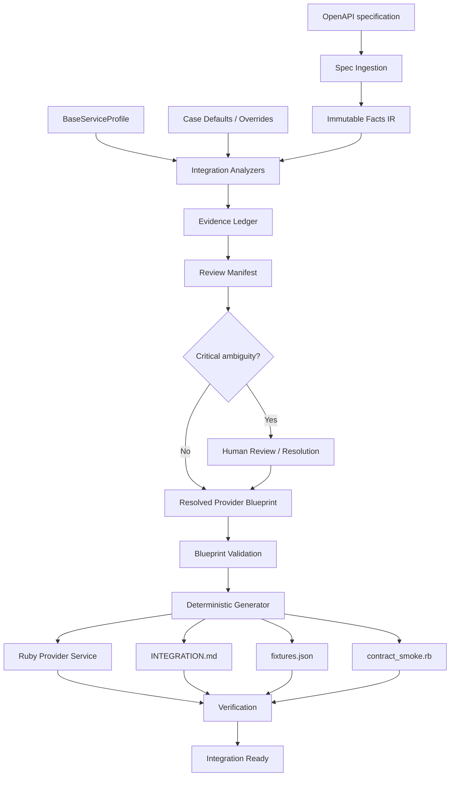
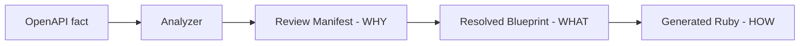

# Provider Compiler

[](https://github.com/EdYaRdx/Ruby_hack/actions/workflows/ci.yml)

> OpenAPI → evidence-backed Provider Blueprint → verified Ruby adapter

Provider Compiler принимает OpenAPI платёжного провайдера, сопоставляет
provider-specific API с контрактом Space Payments, формирует `Review Manifest` и
`Resolved Provider Blueprint`, а затем детерминированно генерирует Ruby adapter,
документацию и fixtures. Критическая неоднозначность не угадывается: система
переходит в `REVIEW_REQUIRED` / `BLOCKING` и запрещает unsafe generation.

| | |
|---|---|
| Вход | OpenAPI YAML / JSON |
| Выход | Ruby adapter + `INTEGRATION.md` + `fixtures.json` |
| Target contract | `Provider::BaseService` |
| Decision model | `ACCEPT` / `REVIEW_REQUIRED` / `UNKNOWN` |
| Safety | critical ambiguity → generation blocked |
| Runtime | Ruby, deterministic, no neural networks |

## Проблема

Space Payments регулярно подключает новых платёжных провайдеров. Ручная
интеграция включает чтение документации, сопоставление endpoints и полей,
money conversions, статусы, auth, webhooks, idempotency, ошибки, Ruby adapter,
fixtures и integration docs; один provider занимает примерно 2–5 дней.

Обычный OpenAPI codegen автоматизирует HTTP boilerplate, но не отвечает на
главный вопрос: как provider-specific API отображается на payment-domain
contract Space Payments. Именно это mapping, а не создание HTTP-классов, является
центральной задачей Provider Compiler.

## Чем отличается от OpenAPI Generator

Обычный OpenAPI codegen:

```text
OpenAPI
  → API client / SDK
```

Provider Compiler:

```text
OpenAPI
  → facts
  → payment semantics
  → evidence / review
  → Provider Blueprint
  → verified Provider::BaseService adapter
```

| | OpenAPI Generator | Provider Compiler |
|---|---|---|
| HTTP client | Да | Да, как часть adapter |
| Payment semantics | Нет | Да |
| Status mapping | Обычно нет | Да |
| Money units | Обычно нет | Да |
| Review ambiguous semantics | Нет | Да |
| Fail-closed generation | Нет | Да |
| `Provider::BaseService` adapter | Нет | Да |

Provider Compiler не позиционируется как generic SDK generator: его результатом
является проверяемая проекция provider API на конкретный host contract.

## Как работает

1. OpenAPI читается и нормализуется; local `$ref` разрешаются до анализа.
2. Immutable `Facts IR` сохраняет факты входного документа без semantic guesses.
3. Independent analyzers строят решения для operations, money, auth, fields,
   statuses, webhooks, idempotency, constraints и errors.
4. Evidence и provenance попадают в `Review Manifest` вместе с rationale,
   conflicts и outcome.
5. Resolved decisions формируют `Provider Blueprint` — source of truth для
   generation.
6. Critical ambiguity переводит pipeline в fail-closed состояние.
7. Deterministic Generator создаёт Ruby adapter и сопутствующие артефакты.
8. Verification проверяет generated output.

## Архитектура



Слои намеренно разделены:

- `Spec Ingestion` — YAML/JSON, OpenAPI validation, local `$ref` resolving и
  fingerprint исходного closure;
- `Facts IR` — immutable набор фактов, без semantic guesses;
- `Analyzers` — provider-to-host mapping и safety decisions;
- `Review Manifest` — почему принято решение: evidence, provenance, rationale,
  conflicts и outcome;
- `Provider Blueprint` — что именно будет сгенерировано;
- `Generator` — как это будет выражено в deterministic Ruby projection, без новых
  semantic decisions;
- `Verification` — проверка generated output.

### Review Manifest vs Provider Blueprint



`Review Manifest` отвечает: «почему принято это решение?». `Provider Blueprint`
отвечает: «какой должна быть интеграция?». Generated Ruby отвечает: «как это
исполняется?». Generated Ruby не является source of truth: им остаётся resolved
Blueprint, а provenance решения сохраняется в Manifest.

### Core invariants

- `FACT` не равен `INFERENCE`; Facts IR immutable.
- Semantic decisions не живут в templates.
- Resolved Blueprint — source of truth, generated Ruby — projection.
- Critical semantics fail closed; каждое решение имеет provenance.
- Unknown provider information сохраняется и показывается.
- CLI и Web используют один Application/Core pipeline.
- Provider-specific assumptions не попадают в generic core.

## Fail Closed

Например, если в спецификации есть только:

```yaml
amount:
  type: integer
```

но не указано, используются ли major или minor units, какой scale и какова
currency semantics, система не выбирает молча `×100` или `÷100`. Результат —
`REVIEW_REQUIRED`, `BLOCKING`, generation unavailable. Для критической финансовой
семантики система предпочитает безопасную остановку потенциально неверной
генерации.

## Автоматически обновляемый снимок возможностей

Снимок возможностей ниже генерируется из checkout проекта, canonical example и
результатов проверок. Он обновляется командой `bin/update_docs`.

<!-- BEGIN GENERATED: CAPABILITIES -->
- OpenAPI ingestion, local reference resolution and source fingerprinting are implemented in `lib/provider_compiler/core.rb`.
- Evidence-aware analysis, Review Manifest and Provider Blueprint are implemented across the analyzer/profile/blueprint layers.
- Deterministic Ruby projection and verification are implemented by the generator and verification layers.
- Canonical NovaPay example: 7 files in `examples/novapay/` (`INTEGRATION.md`, `contract_smoke.rb`, `fixtures.json`, `provider_api.yaml`, `provider_blueprint.json`, `review_manifest.json`, `service.rb`).
- Independent semantic validation: the NovaPay mutation benchmark and Aurora/Helios comparisons are included in the generated status below.
- Live provider calls are not implemented; the Web UI Demo Workbench is implemented in `lib/provider_compiler/web.rb`, `lib/provider_compiler/web_renderer.rb` and `web/public/`.

Run `ruby bin/update_docs` to refresh this snapshot.
<!-- END GENERATED: CAPABILITIES -->

## CLI

### Input precedence and spec-only mode

OpenAPI is the primary semantic source. `CaseDefaults` are optional,
explicitly supplied provider overrides or fallback business knowledge; they are
not selected from an uploaded filename or fingerprint.

```powershell
# arbitrary provider: empty provider defaults
ruby bin/provider_compiler inspect --spec path/to/provider.yaml

# explicit provider-specific knowledge
ruby bin/provider_compiler inspect --spec path/to/provider.yaml `
  --defaults path/to/provider_defaults.yml
```

The `inspect` output reports `spec`, host profile and `provider_defaults` so the
knowledge sources are visible. The built-in NovaPay reference command remains
an explicit demo/reference mode, not the generic upload path.

The generated fixture priority is `SPEC_EXAMPLE` > schema example/default/enum
> deterministic schema sample > `CaseDefaults` fallback. Every generated
`fixtures.json` records provenance and stays byte-deterministic.

Требуется Ruby >= 3.0. Текущий checkout проверен на Ruby 4.0.6 и Bundler 2.5.22.

```powershell
bundle install
bundle exec rspec
ruby -c lib/provider_compiler.rb
ruby bin/provider_compiler inspect
ruby bin/provider_compiler analyze
ruby bin/provider_compiler generate --out tmp/generated
ruby bin/provider_compiler verify --out tmp/generated
```

`inspect` выводит decision summary, `analyze` создаёт артефакты без отдельного
финального запуска Blueprint validation, а `generate` выполняет validation перед
generation. `verify` принимает каталог generated output и запускает Ruby syntax
checks и `contract_smoke.rb`.

Для другого провайдера используются явные входы:

```powershell
ruby bin/provider_compiler generate `
  --spec path/to/provider.yaml `
  --profile profiles/space_payments_v1.yml `
  --defaults path/to/provider_defaults.yml `
  --out tmp/provider
```

Профили и case defaults остаются входами конкретного кейса, а provider-specific
assumptions не зашиваются в generic analyzer-код. Вместо `--out` можно передать
реальный alias `--output`; `PROVIDER_SPEC` задаёт spec по умолчанию.

## Эталонный пример NovaPay

Воспроизводимый источник —
[`fixtures/novapay_provider_api.yaml`](fixtures/novapay_provider_api.yaml).
Каноническая сгенерированная проекция поддерживается командой
`bin/update_examples` в каталоге [`examples/novapay/`](examples/novapay/).
SHA-256 официального reference input:
`415F50EE36FB331DFAB49CEED0E8ED3B0EBE16053D7E00DBABD32282F4396551`.

Эталонный кейс показывает:

- `POST /payouts` -> `create_request`;
- `GET /payouts/{payout_id}` -> `fetch_status`, operationId
  `getPayoutStatus`;
- sandbox base URL из официальной спецификации: `https://api.sandbox.novapay.example/v1`;
- `operation.amount` хоста как major RUB и amount провайдера как minor kopecks;
  request conversion — `major -> minor` с factor `100`;
- необязательный по OpenAPI `Idempotency-Key`; по умолчанию адаптер отправляет
  переданный ключ (`if_available`), а `--always-send-idempotency` — явная политика
  адаптера, не факт спецификации;
- `/balance` сохраняется как неблокирующий `EXTRA_OPERATION`;
- webhook `payout.completed` с `X-NovaPay-Signature`, HMAC-SHA256, raw body и
  hex encoding;
- mapping provider status `completed` → `approved`;
- webhook event `payout.completed` → `approved` → callback action
  `approve_operation`.

End-to-end пример для `1500.50 RUB`:

```text
Space Payments operation.amount: 1500.50 RUB
  → major_to_minor ×100
NovaPay request.amount: 150050 kopecks

NovaPay status: completed
  → Space Payments status: approved
  → callback action: approve_operation
```

`GET /balance` не становится canonical `BaseService` operation без основания: он
сохраняется как `EXTRA_OPERATION` и остаётся неблокирующим.

## Что генерируется

Команда `generate` создаёт шесть файлов в output directory:

```text
tmp/generated/
├── service.rb
├── INTEGRATION.md
├── fixtures.json
├── provider_blueprint.json
├── review_manifest.json
└── contract_smoke.rb
```

- `service.rb` — generated `Provider::BaseService` adapter;
- `INTEGRATION.md` — настройка и использование интеграции;
- `fixtures.json` — request/response/webhook examples;
- `provider_blueprint.json` — resolved integration contract;
- `review_manifest.json` — evidence и decisions;
- `contract_smoke.rb` — executable runtime smoke test.

Канонический `examples/novapay/` дополнительно хранит копию входного
`provider_api.yaml`, поэтому там семь файлов. Generated artifacts следует
пересоздавать из fixture/profile/defaults, а не редактировать вручную.

## Web UI

Локальный Demo Workbench показывает тот же pipeline, не меняя семантику
компилятора:

```powershell
bundle exec ruby bin/provider_compiler_web
```

Откройте `http://127.0.0.1:4567` и пройдите flow
«Загрузка» → «Анализ» → «Review» → «Preview» → «Generate». На экране анализа
видны endpoints, canonical operations, auth, money, statuses, webhook,
idempotency, field mappings, constraints, errors и evidence. Review показывает
решения Manifest и их основания; Preview выполняет request/response/webhook
projections на fixture-данных; Generate показывает артефакты и Verification.

На стартовом экране доступны NovaPay, неоднозначный money-case и Aurora. UI не
выполняет реальных сетевых вызовов к provider.

## Что система анализирует

| Область | Пример |
|---|---|
| Operations | `POST /payouts` → `create_request` |
| Authentication | `X-API-Key` |
| Money | `major` → `minor` ×100 |
| Fields | `operation.amount` → `request.amount` |
| Statuses | `completed` → `approved` |
| Webhooks | `HMAC-SHA256` |
| Idempotency | `Idempotency-Key` |
| Constraints | `required` / `minimum` / `enum` |
| Errors | `400` / `401` / `409` / `422` / `429` / `500` |
| Extras | `/balance` preserved as `EXTRA_OPERATION` |

## Verification

`Verification` проверяет только существующие в реализации gates: наличие
generated `service.rb` и `contract_smoke.rb`, Ruby syntax для обоих файлов и
успешное выполнение contract smoke. Сам smoke проверяет request projection,
money conversion, sandbox URL, response/status mapping и webhook behavior на
fixture-данных.

## Universality и benchmark

Универсальность здесь означает переносимость generic pipeline на покрытые
provider shapes, а не поддержку любого OpenAPI. Проверка состоит из NovaPay
reference case, 37 independently materialized mutation scenarios с hand-authored
semantic ground truth и independent comparator, а также второго synthetic
provider Aurora с другой структурой API.

Aurora проверяет другой endpoint naming, Bearer auth, nested `money.value`,
`money.currency`, destination, `POST /notifications`, собственные status enums и
preserved extra operations. Для него отдельно заданы semantic levels и
behavioral vectors; decision equality сама по себе не считается доказательством.

HeliosPay — blind third-provider validation с hand-authored ground truth,
созданным до запуска compiler. Он проверяет другие operationId и paths,
query API-key auth, nested `payment` / `settlement` money, HTTP `202` success
handling, provider error codes и `Retry-After`, webhook events, а также
сохранение `/account/limits` как extra operation. Это дополнительное evidence,
что generic pipeline не привязан к NovaPay literals; это не заявление о полной
универсальности для любого OpenAPI.

В этой проверке Aurora — второй synthetic provider, а HeliosPay — blind
third-provider validation.

Подробная методика и определения метрик находятся в
[`docs/BENCHMARK.md`](docs/BENCHMARK.md). Исторический comparator record — в
[`research/SEMANTIC_BENCHMARK_VALIDATION.md`](research/SEMANTIC_BENCHMARK_VALIDATION.md),
а supporting validation второго провайдера — в
[`research/SECOND_PROVIDER_VALIDATION.md`](research/SECOND_PROVIDER_VALIDATION.md).

## Статус проверки

Следующий блок генерируется `bin/update_docs` на основе реальных benchmark
runner-ов и текущего запуска RSpec. Числа не копируются вручную.

<!-- BEGIN GENERATED: PROJECT_STATUS -->
**Current verification snapshot (generated)**

- RSpec: 77 examples, failures: 0.
- Reference mutation benchmark: 37/37 adversarial mutations of one reference provider domain; semantic accuracy: 100.0%; critical false ACCEPTs: 0.
- NovaPay official spec-only baseline: decision automation 10/14 (71.4%); review rate 4/14 (28.6%); fully auto-ready 0/1 (0.0%); false ACCEPTs 0; unsafe generation attempts 0.
- NovaPay spec-only mutation lane: decision automation 74/98 (75.5%); review rate 24/98 (24.5%); fully auto-ready 0/7 (0.0%); false ACCEPTs 0; unsafe generation attempts 0.
- Aurora spec-only: decision automation 12/14 (85.7%); fully auto-ready 0/1 (0.0%). Aurora resolved: 1/1 (100.0%); behavioral vectors 4/4.
- HeliosPay spec-only: decision automation 11/13 (84.6%); fully auto-ready 0/1 (0.0%). Resolved: 1/1 (100.0%); behavioral vectors 4/4.

Run `ruby bin/update_docs` to refresh this snapshot from the benchmark and RSpec outputs.
<!-- END GENERATED: PROJECT_STATUS -->

## Judge-facing metrics

Decision automation measures accepted decisions. Fully auto-ready measures
complete specifications with zero `REVIEW_REQUIRED` decisions and zero
blocking entries. These are different metrics; safety is reported separately.
Safety includes Critical false ACCEPTs and unsafe generation attempts.

<!-- BEGIN GENERATED: JUDGE_METRICS -->
| Lane | Decision automation | Review rate | Fully auto-ready | Safety |
|---|---:|---:|---:|---|
| NovaPay official spec-only | 10/14 (71.4%) | 4/14 (28.6%) | 0/1 (0.0%) | false ACCEPTs 0; unsafe generation attempts 0 |
| NovaPay spec-only mutation lane (7 cases) | 74/98 (75.5%) | 24/98 (24.5%) | 0/7 (0.0%) | false ACCEPTs 0; unsafe generation attempts 0 |
| Aurora spec-only | 12/14 (85.7%) | 2/14 (14.3%) | 0/1 (0.0%) | false ACCEPTs 0; unsafe generation attempts 0 |
| Aurora resolved | 14/14 (100.0%) | 0/14 (0.0%) | 1/1 (100.0%) | false ACCEPTs 0; unsafe generation attempts 0 |
| HeliosPay spec-only | 11/13 (84.6%) | 2/13 (15.4%) | 0/1 (0.0%) | false ACCEPTs 0; unsafe generation attempts 0 |
| HeliosPay resolved | 13/13 (100.0%) | 0/13 (0.0%) | 1/1 (100.0%) | false ACCEPTs 0; unsafe generation attempts 0 |

Decision automation is an accepted-decision metric, not a readiness claim. Full-spec auto-ready means a complete spec has zero `REVIEW_REQUIRED` decisions and zero blocking entries. Blocking is reported separately because one decision may produce multiple blocking entries. The benchmark also reports generation/runtime gates where generation is attempted.
<!-- END GENERATED: JUDGE_METRICS -->

Регрессионное покрытие UI находится в [`spec/web_spec.rb`](spec/web_spec.rb).

## Documentation

- [`docs/ARCHITECTURE.md`](docs/ARCHITECTURE.md) — текущая архитектура и
  инварианты;
- [`docs/BENCHMARK.md`](docs/BENCHMARK.md) — методика, формулы и актуальные
  результаты;
- [`docs/DEMO.md`](docs/DEMO.md) — готовый live-сценарий для Web UI, fail-closed,
  Aurora и CLI fallback;
- [`docs/DEVELOPMENT.md`](docs/DEVELOPMENT.md) — процесс разработки и проверок;
- [`docs/DOCS_POLICY.md`](docs/DOCS_POLICY.md) — правила для стабильной и
  generated-документации;
- [`docs/COMPLIANCE.md`](docs/COMPLIANCE.md) — LOC-based Ruby majority audit;
- [`docs/GLOSSARY.md`](docs/GLOSSARY.md) — единый словарь терминов;
- [`THIRD_PARTY.md`](THIRD_PARTY.md) — зависимости и лицензии;
- [`research/README.md`](research/README.md) — supporting research и audit
  artifacts с явным разделением текущих и исторических материалов.

## Repository structure

```text
bin/                    CLI, Web entrypoint и детерминированные updater-ы
lib/provider_compiler/  Facts IR, analyzers, Blueprint, generation, Web/API
profiles/               BaseServiceProfile для host-контракта
fixtures/               OpenAPI, case defaults и независимая Aurora ground truth
examples/               сгенерированные и проверяемые provider projections
spec/                   RSpec regression, semantic и Web UI проверки
research/               benchmark corpus, comparator и исторические материалы
docs/                   актуальная engineering и judge-facing документация
.github/workflows/      reproducible GitHub Actions verification
```

## Verification / CI

Workflow [`CI`](.github/workflows/ci.yml) выполняет RSpec, Ruby syntax audit,
Ruby-share compliance audit, reference benchmark, NovaPay spec-only benchmark,
Aurora, HeliosPay, оба deterministic updater-а и `git diff --check`. Он не
использует credentials, live provider API или browser; кроме checkout и
установки gems, проверки работают offline.

Локальный эквивалент полного прогона:

```powershell
bundle exec rspec
ruby bin/audit_ruby_share
ruby research/benchmark/run.rb
ruby research/benchmark/spec_only.rb
ruby research/benchmark/second_provider.rb
ruby research/benchmark/third_provider.rb
ruby bin/update_docs
ruby bin/update_examples
git diff --check
```

## Limitations

Это research/hackathon prototype, а не SaaS и не заявление о поддержке любого
провайдера. Production `Provider::BaseService` в репозитории не предоставлен:
для verification используется local stub/harness. Live provider calls, production
credentials и deployment не входят в scope.

Для нового provider могут потребоваться явные profile, case defaults и human
review полученного Manifest. Remote `$ref` не поддерживаются и отклоняются;
некоторые provider semantics остаются `REVIEW_REQUIRED` или `UNKNOWN`, пока не
появятся достаточные evidence и resolution.

## Hackathon compliance

Ruby share измеряется по participant-written source LOC: blank lines и
comment-only lines исключены; generated examples, data, docs и dependencies не
считаются. Текущий production-only результат — `92.8%`, production + tests —
`94.3%`. Методология и machine-readable evidence находятся в
[`docs/COMPLIANCE.md`](docs/COMPLIANCE.md) и
[`research/ruby_share_audit.json`](research/ruby_share_audit.json).

Core functionality не зависит от proprietary runtime service: dependencies —
open-source gems, generated output не требует внешнего inference service, а
runtime работает детерминированно и без нейросетевых моделей. Project license
file отсутствует; случайная лицензия автоматически не добавлялась. Лицензии
используемых зависимостей перечислены в [`THIRD_PARTY.md`](THIRD_PARTY.md).

## Безопасность и соответствие ограничениям

Спецификации обрабатываются локально; UI не сохраняет production credentials и
не выполняет вызовы провайдера. Неизвестная или критически неоднозначная
семантика сохраняется в `Review Manifest` и не превращается молча в `ACCEPT`.
Source fingerprint включает root document, resolved local inputs и resolver
policy.

Для расширения системы используйте [`docs/DEVELOPMENT.md`](docs/DEVELOPMENT.md)
и соблюдайте инварианты безопасности из
[`docs/ARCHITECTURE.md`](docs/ARCHITECTURE.md).
